# Go2 Low-Friction Locomotion Benchmark
### A reinforcement learning project that improves quadruped stability under low-friction conditions (e.g., wet floors, ice, tiles).

---

## 🌧️ Introduction

Teaching a robot to walk is a classic problem in robotics and reinforcement learning.  
With modern RL methods like PPO, quadruped robots can achieve stable locomotion in simulation.

However, a key challenge remains:

👉 **Policies trained in ideal conditions often fail when the environment changes.**

---

## 🌍 Motivation

Imagine a quadruped robot walking on:

- Wet marble floors (μ ≈ 0.1–0.2)
- Icy roads in winter
- Polished indoor tiles

In these conditions, robots easily slip and lose balance.

👉 This project focuses on improving locomotion robustness under low-friction environments.

---

## 🎥 Demo: Robustness under Different Terrains

### 🟦 Flat Terrain (Normal Ground)

| Baseline Policy | Robust Policy (Slippery-Trained) |
|----------------|----------------------------------|
|  |  |

👉 Both policies perform well on flat terrain.

---

### 🧊 Slippery Terrain (Low Friction μ ≈ 0.1–0.2)

| Baseline Policy | Robust Policy (Slippery-Trained) |
|----------------|----------------------------------|
|  |  |

👉 Baseline becomes unstable, while the robust policy maintains balance and tracking performance.

### Result

| Scenario | Outcome |
|----------|--------|
| Flat + baseline | Stable |
| Slippery + baseline | Falls |
| Slippery + robust | Stable |

👉 The robust policy significantly improves stability under external disturbance.

📌 **Observation:**

Low-friction surfaces significantly degrade velocity tracking performance.

👉 This highlights a **critical deployment risk** for real-world quadruped systems.

---

⚖️ Robustness Without Conservativeness

A common concern in robustness-oriented training is that policies become overly conservative, sacrificing speed or responsiveness.

However, this is not observed in our case:

At low velocities, the robust policy achieves better tracking and faster convergence
At higher velocities, performance remains comparable to baseline
Under low-friction conditions, stability is improved without degrading motion quality

👉 This is directly evidenced by the velocity tracking results shown below, including tracking accuracy and steady-state behavior.

---

## 📊 Overall Comparison

  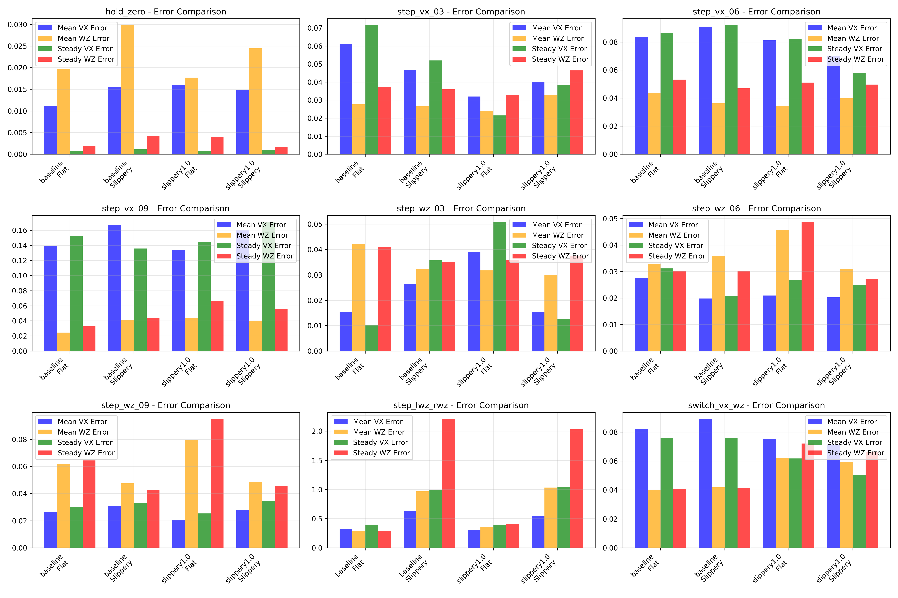

👉The robust (slippery-trained) policy achieves lower mean and steady-state errors in most cases, particularly at low-to-medium linear and angular velocities as well as during standstill, while maintaining comparable performance to the baseline at higher speeds.

---

## ⚠️ Extreme Case: Rapid Yaw Reversal (lwz → rwz)

| Terrain | Baseline | Robust |
|--------|----------|--------|
| Flat | 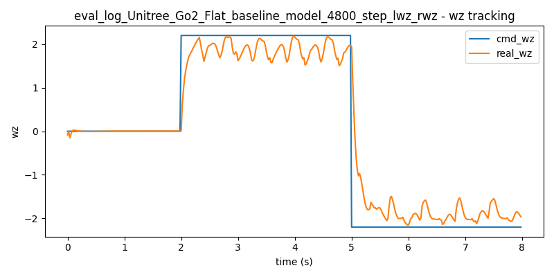 | 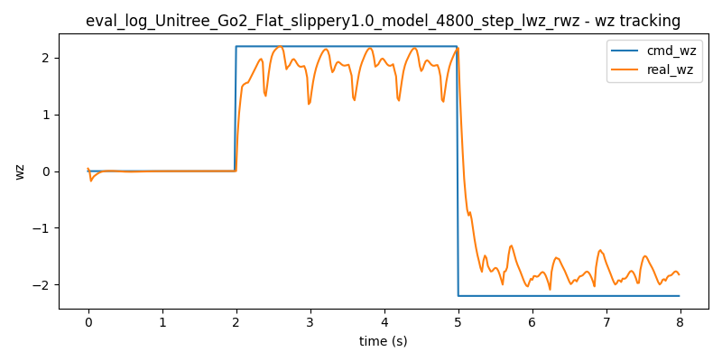 |
| Slippery | 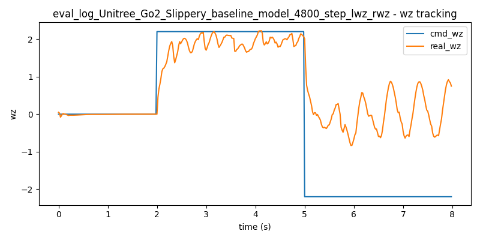 | 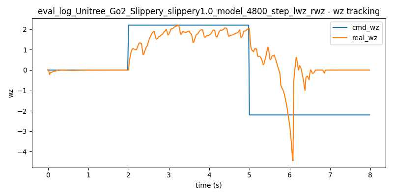 |

👉 Stress test under abrupt direction switching (high angular acceleration).

---
## 📈 Velocity Tracking (vx = 0.3)

| Terrain | Baseline | Robust |
|--------|----------|--------|
| Flat | 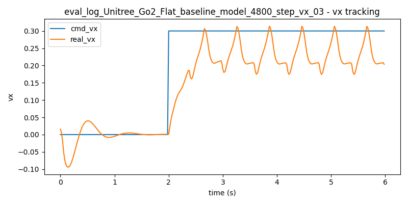 | 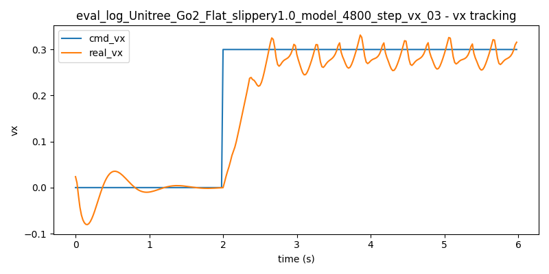 |
| Slippery | 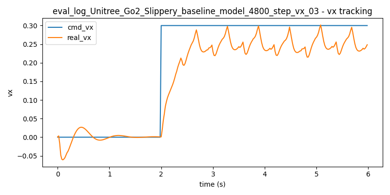 | 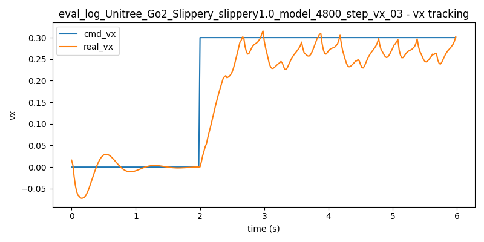 |

---

## 📈 Velocity Tracking (vx = 0.6)

| Terrain | Baseline | Robust |
|--------|----------|--------|
| Flat | 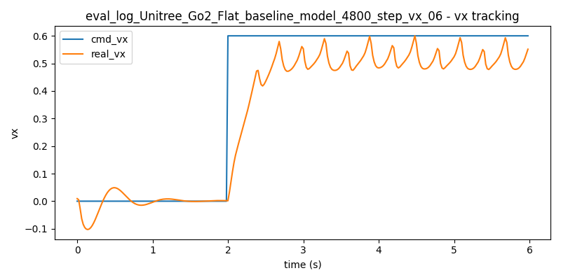 | 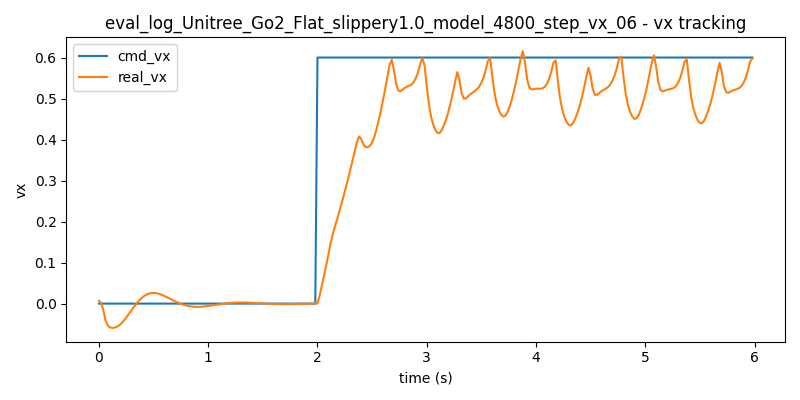 |
| Slippery | 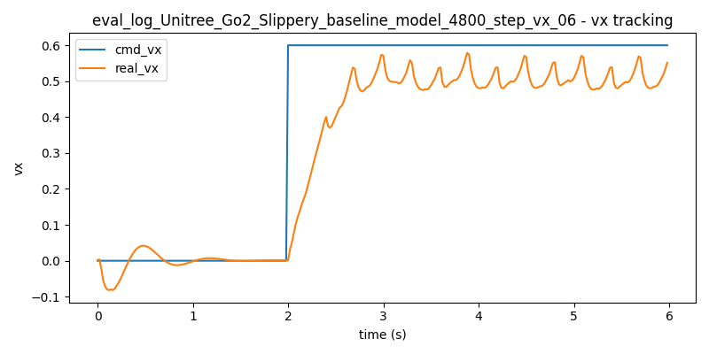 | 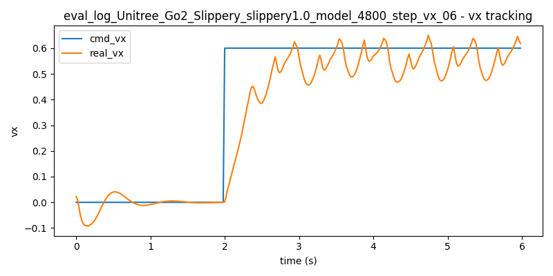 |

---

## 📈 Velocity Tracking (vx = 0.9)

| Terrain | Baseline | Robust |
|--------|----------|--------|
| Flat | 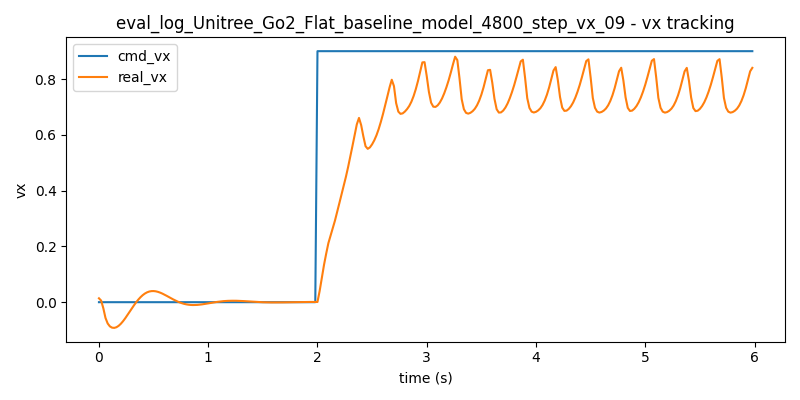 | 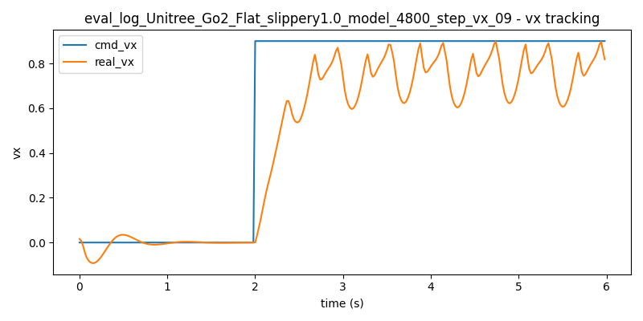 |
| Slippery | 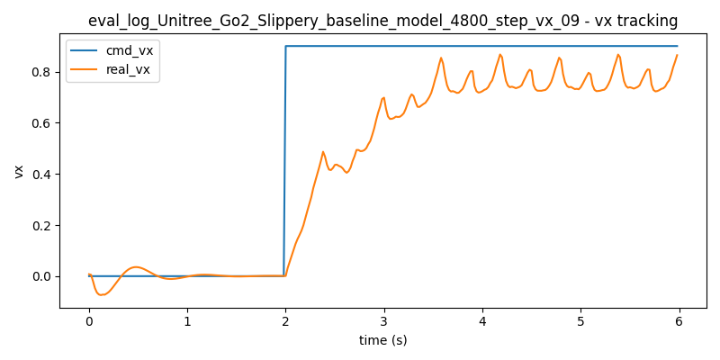 | 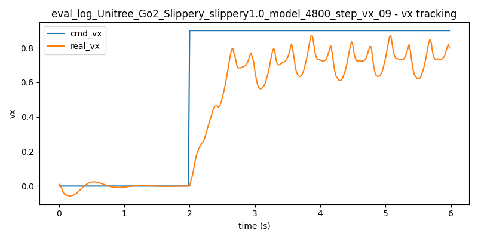 |

---

## 🔄 Angular Velocity Tracking (wz = 0.3)

| Terrain | Baseline | Robust |
|--------|----------|--------|
| Flat | 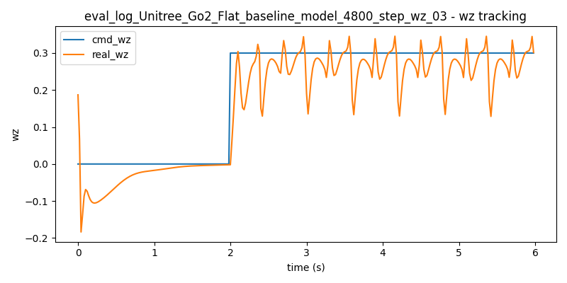 | 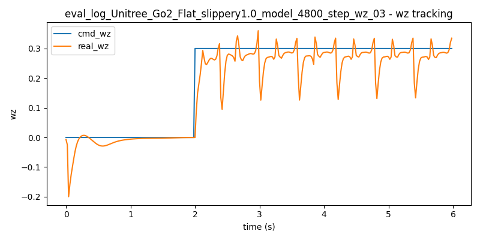 |
| Slippery | 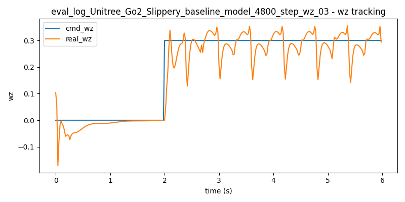 | 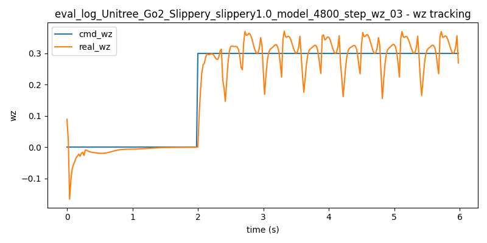 |

---

## 🔄 Angular Velocity Tracking (wz = 0.6)

| Terrain | Baseline | Robust |
|--------|----------|--------|
| Flat | 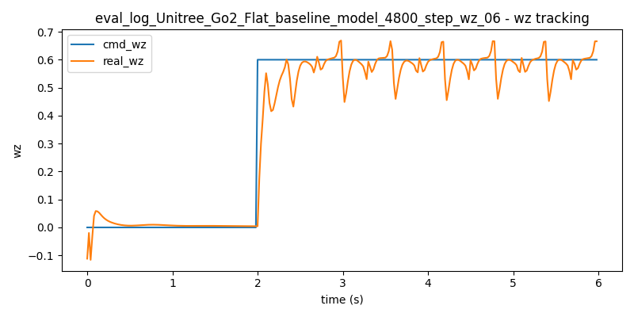 | 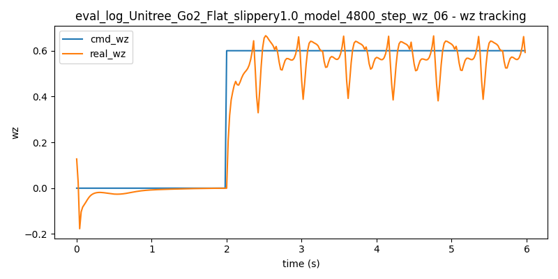 |
| Slippery | 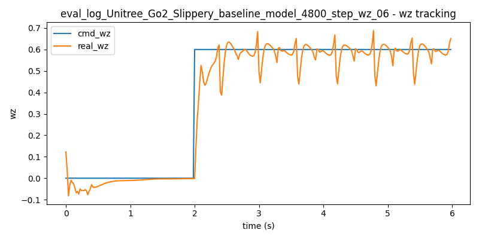 | 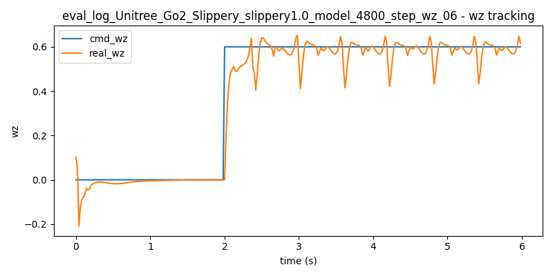 |

---

## 🔄 Angular Velocity Tracking (wz = 0.9)

| Terrain | Baseline | Robust |
|--------|----------|--------|
| Flat | 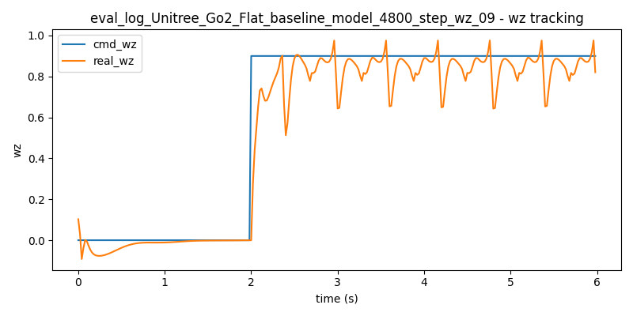 | 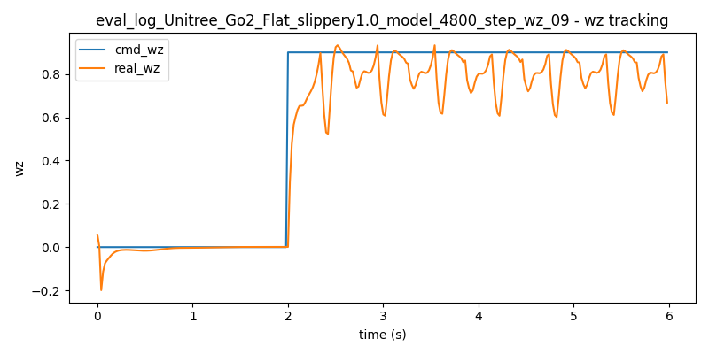 |
| Slippery | 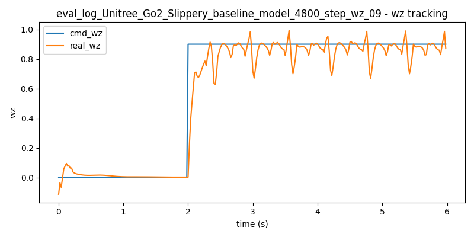 | 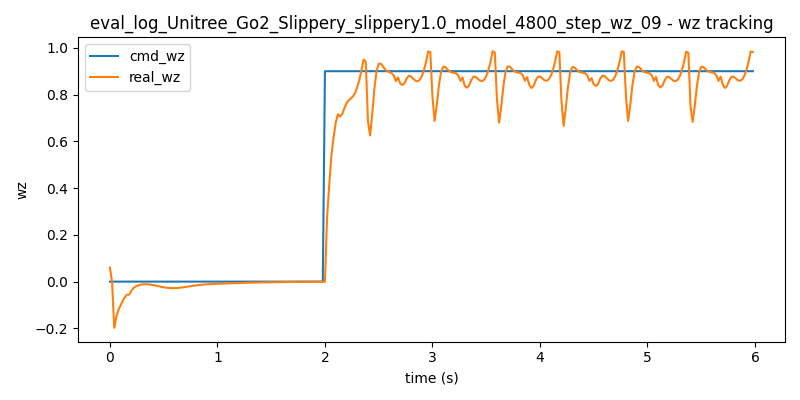 |

👉 Both policies degrade on slippery terrain, but the slippery-trained policy achieves faster convergence and lower steady-state error at low-to-medium speeds, while remaining comparable at higher velocities.

---

## 📊 Qualitative Comparison (Robust vs Baseline)

| Setting | Mean Error | Convergence | Steady Error | Stability |
|--------|-----------|------------|-------------|----------|
| **Linear (low) - Flat** | ↑ | ↑ | ↑ | ✓ |
| **Linear (low) - Slippery** | ↑ | ↑ | ↑ | ✓ |
| **Linear (medium) - Flat** | ↑ | ↑ | ↑ | ✓ |
| **Linear (medium) - Slippery** | ↑ | ↑ | ↑ | ✓ |
| **Linear (high) - Flat** | ↑ | ↑ | ≈ | ✓ |
| **Linear (high) - Slippery** | ↑ | ↑ | ↓ | ✓ |
| **Angular (low) - Flat** | ↑ | ≈ | ↑ | ✓ |
| **Angular (low) - Slippery** | ↑ | ≈ | ↓ | ✓ |
| **Angular (medium) - Flat** | ↓ | ≈ | ↓ | ✓ |
| **Angular (medium) - Slippery** | ↑ | ≈ | ↑ | ✓ |
| **Angular (high) - Flat** | ↓ | ≈ | ↓ | ✓ |
| **Angular (high) - Slippery** | ≈ | ≈ | ≈ | ✓ |
| **Standstill - Flat** | ↑ | ≈ | ≈ | ✓ |
| **Standstill - Slippery** | ↑ | ≈ | ≈ | ✓ |
| **Rapid Yaw Reversal - Flat** | ↓ | ≈ | ↑ | ✓ |
| **Rapid Yaw Reversal - Slippery** | ↑ | ≈ | ↑ | ↑↑ |

**Legend:**  
↑ better than baseline  ↓ worse than baseline  ≈ comparable  ✓ no failure  ↑↑ significantly more stable

---

## ⚙️ Methodology

- Policy: PPO-based locomotion controller (MuJoCo, Unitree Go2)  
- Training environments:
  - Flat ground (baseline)  
  - Low-friction ground with randomized μ ∈ [0.1, 1.2]  

- Evaluation:
  - fixed-command benchmark  
  - identical command sequences across environments  

- Metrics:
  - mean absolute tracking error  
  - steady-state error  
  - convergence behavior  
---
## 📉 Training Performance

| Baseline | Robust (Slippery-Trained) |
|----------|---------------------------|
| 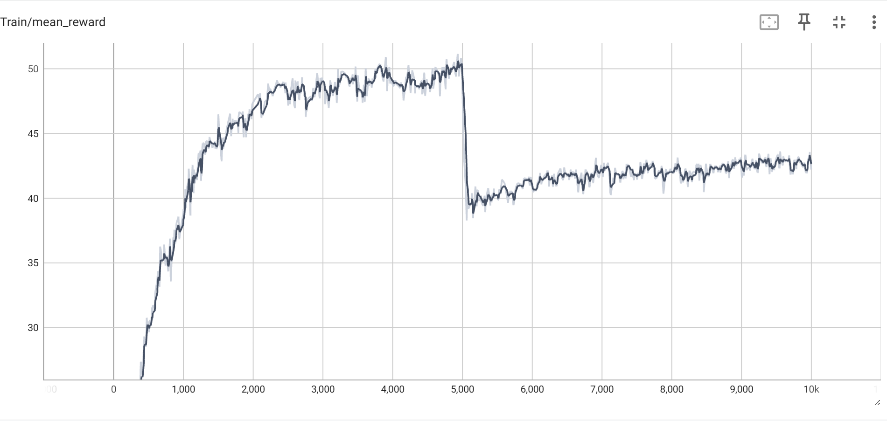 | 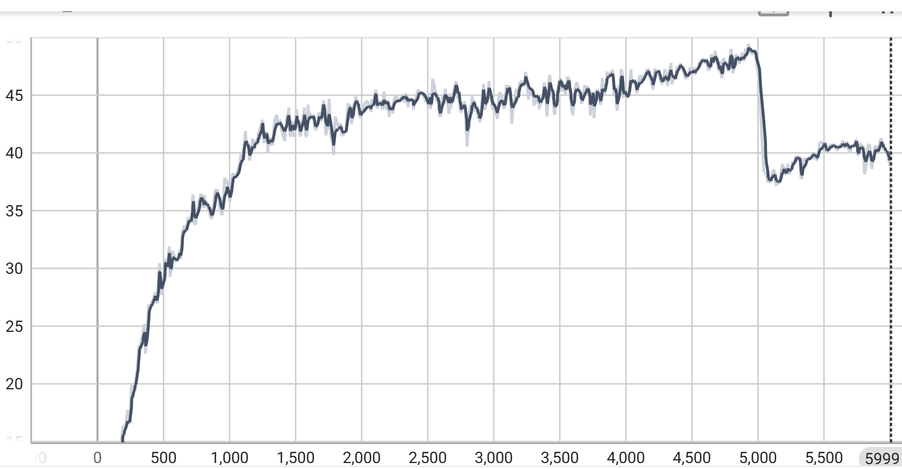 |

👉 Both models reach peak performance around 4800（env=256） iterations, after which a noticeable drop in reward is observed.

👉 We select checkpoints near this peak for evaluation.

## 🚀 Quick Start

## 🚀 Quick Start

To reproduce this project, first clone the original Unitree RL repository and navigate into the project directory.

Then replace the following files with the modified versions provided in this repository:

### 📁 File Replacement Guide

- `comprehensive_plot.py` → scripts 
- `eval_fixed_cmd.py` → scripts 
- `analyze_and_plot_eval.py` → scripts

- `go2_eval_cmd_set_v1.json` → `tmp/go2_eval_cmd_set_v1.json`  

- `velocity_env_cfg.py` → `src/tasks/velocity/velocity_env_cfg.py`  

- `env_cfgs.py` → `src/tasks/velocity/config/go2/env_cfgs.py`  
- `__init__.py` → `src/tasks/velocity/config/go2/__init__.py`  

---

Once all files are correctly replaced, run the corresponding scripts using the commands provided at the end of each file (e.g., training or evaluation scripts).
extra instruction：

slippery instruction：

CUDA_VISIBLE_DEVICES=0 python scripts/train.py Unitree-Go2-Slippery-Train \
  --agent.run_name slippery_train_v1 \
  --env.scene.num_envs 256 \
  --agent.max_iterations 6000

baseline instruction：

Use the official default settings, with the number of parallel environments chosen according to your available resources.

